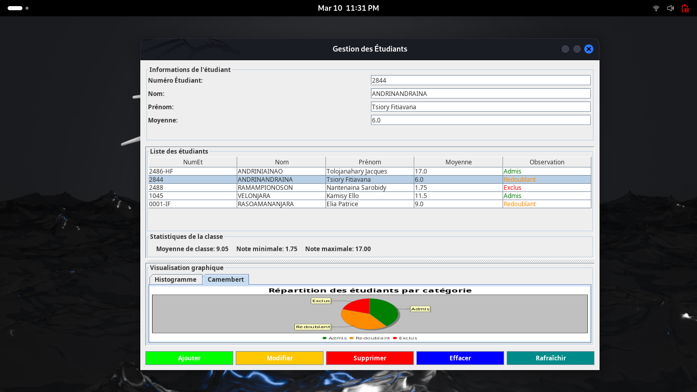

# 🎓 Student Management System

## 📌 Overview

The **Student Management System** is a full-stack Java application designed to efficiently manage student records. Built using **Java Swing** for the frontend and **Spring Boot with PostgreSQL** for the backend, this project enables users to **add, modify, delete, and view** student data in a user-friendly interface.

## ✨ Features

- 📝 **Add, Update, Delete, and View Students**
- 🔍 **Real-time Search & Filtering**
- 🔄 **Automatic Form Prefill for Modifications**
- 🛡️ **Frontend and Backend Validation to Prevent Duplicates**
- 📊 **Visual Data Representation (Pie Charts & Histograms)**
- 📡 **RESTful API with Spring Boot**
- 🏗️ **PostgreSQL Database Integration**

## 🖥️ Tech Stack

- **Frontend:** Java Swing
- **Backend:** Spring Boot (REST API)
- **Database:** PostgreSQL
- **Tools & Libraries:** Spring Data JPA with Hibernate as JPA Provider, Maven, JDBC

## 🚀 Installation & Setup

### Prerequisites:

- Java 17+
- PostgreSQL Server
- Maven
- IntelliJ IDEA / Eclipse

### Steps:

1. **Clone the repository**:

   ```sh
   git clone https://github.com/jacques-chilas/javaav.git
   cd javaav
   ```

2. **Configure PostgreSQL Database**:

    - Create a PostgreSQL database named <your_database_name>
    - Update `application.properties` with your database credentials:

   ```properties
   spring.application.name=javaav
   server.port=8080

   # PostgreSQL Configuration
   spring.datasource.url=jdbc:postgresql://localhost:5432/your_database_name
   spring.datasource.username=your_username
   spring.datasource.password=your_password

   # PostgreSQL Driver
   spring.datasource.driver-class-name=org.postgresql.Driver

   # Hibernate Properties (JPA)
   spring.jpa.database-platform=org.hibernate.dialect.PostgreSQLDialect
   spring.jpa.hibernate.ddl-auto=update

   # Show SQL Queries in Console
   spring.jpa.show-sql=true
   spring.jpa.properties.hibernate.format_sql=true


   ```

3. **Run the Backend (Spring Boot Application)**:

   ```sh
   mvn spring-boot:run
   ```

4. **Run the Frontend (Java Swing UI)**:

    - Open the project in IntelliJ IDEA or Eclipse
    - Run `GestionDeNote.java`

## 📸 Screenshots



## 🛠️ Future Enhancements

- 📊 **Export Student Data to Excel/PDF**
- 🔔 **Email Notifications for Student Updates**
- 🌍 **Multi-language Support**
- **Spring Security Integration for User Authentication & Role-Based Access Control**
- 📱 **Web-Based Version using ReactJS**

## 💡 Contributing

Contributions are welcome! Feel free to submit issues, fork the project, and create pull requests.

## 📜 License

This project is licensed under the **MIT License**.

## 📬 Contact

💼 **Developer:** Jacques Chilas\
📧 **Email:** [jacqueschilas@gmail.com](mailto\:jacqueschilas@gmail.com)\
𝕏  **X:** [@chilas456](https://x.com/chilas456)

Give this repo a ⭐ if you found it useful!

